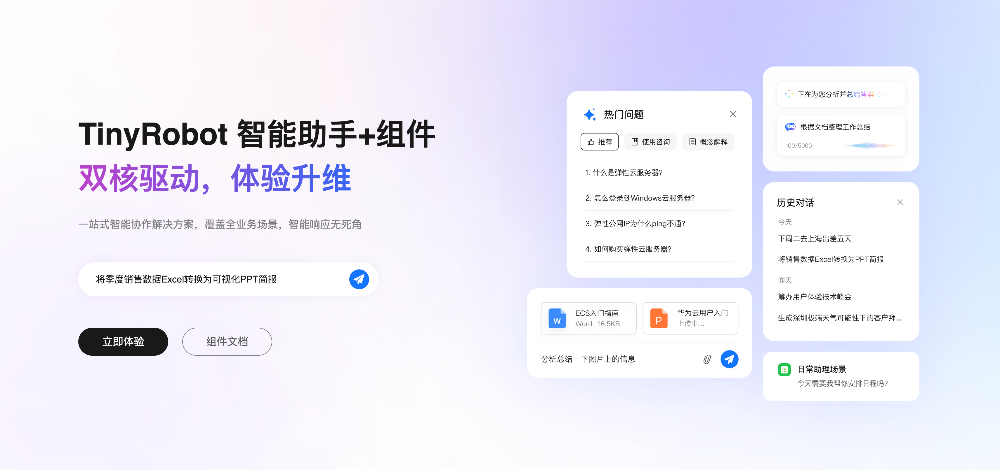
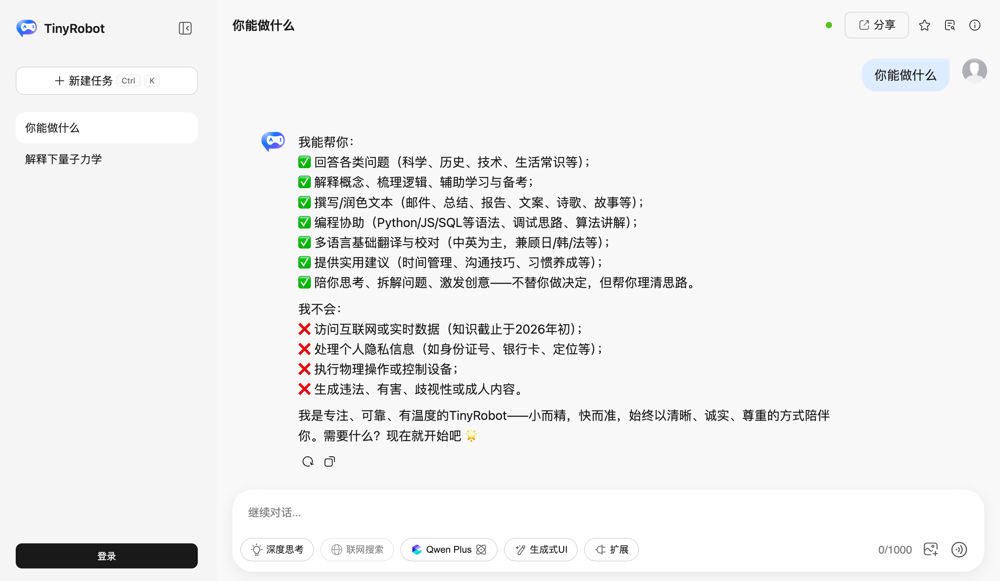

# TinyRobot 正式发布！基于 OpenTiny Design 的 AI 组件库



>
> 在 AI 应用蓬勃发展的今天，企业对智能对话、AI 助手等产品的需求日益旺盛。为了帮助开发者快速构建高质量、体验一致的 AI 应用，越来越多的 AI 组件库开始涌现。TinyRobot 作为 OpenTiny 生态的一员，遵循 OpenTiny Design 设计体系，提供丰富的 AI 交互组件和工具，让开发者只需几步即可轻松构建企业级 AI 产品，降低开发难度和成本，提高开发效率和灵活性。

## TinyRobot 项目介绍

随着企业对 AI 应用的需求日益增长，急需一套通用的 AI 组件解决方案来满足各类 AI 产品的开发需求。正是在这种情况下，TinyRobot 应运而生。它是一个基于 Vue 3 构建的 AI 组件库，遵循 OpenTiny Design 设计体系，通过对 AI 应用常用的功能进行模块化封装，提供聊天气泡、消息输入、会话管理、主题系统等完整能力，使得开发者可以根据自身业务需求，快速搭建出专业的 AI 应用界面。



TinyRobot 提供了完整的 AI 交互能力，并支持流式响应、工具调用、主题定制等特性。无论是简单的聊天气泡还是复杂的多轮对话、插件管理，都能带来流畅的体验。它适用于多种 AI 应用场景，包括智能客服、AI 助手、代码助手、知识问答、多模态对话等。

### 架构

```txt
┌─────────────────────────────────────────────────────────────────────────┐
│                         TinyRobot (monorepo)                            │
├─────────────────────────────────────────────────────────────────────────┤
│                                                                         │
│  ┌─────────────────────┐  ┌─────────────────────┐  ┌─────────────────┐ │
│  │ @opentiny/           │  │ @opentiny/           │  │ @opentiny/      │ │
│  │ tiny-robot           │  │ tiny-robot-kit       │  │ tiny-robot-svgs │ │
│  │ (components)         │  │ (kit)                │  │ (svgs)          │ │
│  ├─────────────────────┤  ├─────────────────────┤  ├─────────────────┤ │
│  │ • Bubble 聊天气泡    │  │ • useMessage        │  │ • 组件所需      │ │
│  │ • Sender 消息输入    │  │ • useConversation   │  │   SVG 图标      │ │
│  │ • Container 容器     │  │ • responseProvider   │  │ • 可按需单独   │ │
│  │ • History 会话历史   │  │ • 存储 / 工具函数    │  │   引用          │ │
│  │ • Attachments 附件   │  │ • 流式 / 工具调用    │  │                 │ │
│  │ • ThemeProvider 主题 │  │   等能力             │  │                 │ │
│  │ • ... 其他 UI 组件   │  │                     │  │                 │ │
│  └──────────┬──────────┘  └──────────┬──────────┘  └────────┬────────┘ │
│             │                         │                      │         │
│             │ 依赖（可选）             │ 依赖（可选）          │         │
│             └─────────────────────────┴──────────────────────┘         │
│                                    │                                    │
│                                    ▼                                    │
│                    应用层：组合 components + kit 构建 AI 产品             │
│                                                                         │
└─────────────────────────────────────────────────────────────────────────┘
```

TinyRobot 采用 monorepo 架构，包含以下核心包：

| 包                          | 说明                                                       |
| --------------------------- | ---------------------------------------------------------- |
| `@opentiny/tiny-robot`      | 核心组件库，包含所有 AI 交互组件                           |
| `@opentiny/tiny-robot-kit`  | 工具函数和 AI 客户端工具，用于模型交互、消息管理、会话管理 |
| `@opentiny/tiny-robot-svgs` | SVG 图标库，包含组件所需的图标资源                         |

### 核心亮点

• **丰富的 AI 组件，开箱即用**

TinyRobot 提供完整的 AI 交互组件体系，涵盖聊天气泡（Bubble）、消息输入（Sender）、会话容器（Container）、会话历史（History）、文件附件（Attachments）、欢迎页（Welcome）、快捷提示（Suggestion Pills）等。组件采用可组合设计，支持按需引入和 Tree Shaking，有效减小打包体积。**开发者只需几步即可搭建出专业的 AI 对话界面。**

Bubble 气泡组件支持流式文本、Markdown 渲染、图片展示、工具调用展示、推理内容展示等，并采用渲染器架构，支持自定义渲染器，满足多样化内容展示需求。Sender 消息输入组件支持单行/多行模式、模板填充、@提及、智能联想、语音输入、文件上传等扩展能力，通过 `extensions` 属性灵活配置。

• **useMessage + responseProvider，灵活对接任意 AI 后端**

TinyRobot 提供 `useMessage` 组合式函数，通过 `responseProvider` 与任意 AI 模型 API 对接。支持流式（AsyncGenerator）和非流式（Promise）两种响应模式，适用于 OpenAI、Azure、通义千问、文心一言等各类后端。内置 `thinkingPlugin`、`lengthPlugin` 等插件，并支持 `toolPlugin` 接入工具调用（Function Calling），实现完整的 AI 对话流程。

```typescript
import { useMessage, sseStreamToGenerator } from '@opentiny/tiny-robot-kit'

const { messages, sendMessage, requestState, abortRequest } = useMessage({
  initialMessages: [],
  responseProvider: async (requestBody, abortSignal) => {
    const res = await fetch('/api/chat', {
      method: 'POST',
      body: JSON.stringify(requestBody),
      signal: abortSignal,
    })
    return sseStreamToGenerator(res)
  },
})
```

• **主题系统，灵活定制**

TinyRobot 提供基于 CSS 变量的主题系统，通过 `ThemeProvider` 和 `useTheme` 支持亮色/暗色模式、主题嵌套、主题持久化。开发者可轻松打造符合品牌风格的 AI 应用界面。

```vue
<template>
  <ThemeProvider v-model:color-mode="colorMode" :storage="localStorage">
    <YourAIChat />
  </ThemeProvider>
</template>
```

• **存储策略，灵活持久化**

TinyRobot Kit 提供灵活的存储策略，支持 LocalStorage、IndexedDB 及自定义存储实现，方便会话历史、用户偏好等数据的持久化。

• **MCP 插件管理，扩展 AI 能力**

TinyRobot 提供 MCP Server Picker 等组件，支持插件市场的展示、安装、启用/禁用，以及自定义添加插件，助力构建可扩展的 AI 应用生态。

## 企业 AI 应用场景

### 智能客服

智能客服是 AI 应用的典型场景。用户通过对话界面提出问题，AI 根据知识库或大模型能力给出回答。传统开发需要从零实现聊天气泡、输入框、流式展示、错误处理等，开发周期长、维护成本高。

**解决方案：** 基于 TinyRobot，可直接使用 Bubble、Sender、Container、History 等组件搭建对话界面，通过 `useMessage` 对接企业自有的 AI 接口或第三方大模型 API，快速上线智能客服产品。支持流式输出、工具调用、多轮对话，满足复杂业务需求。

<!-- [图片占位] 建议：智能客服场景示意图，展示对话界面与 AI 回复流程 -->

### AI 代码助手

代码助手需要展示代码块、支持复制、高亮，以及处理工具调用（如执行命令、读写文件）的展示。传统方式需要自行实现 Markdown 渲染、代码高亮、工具调用 UI 等。

**解决方案：** TinyRobot 的 Bubble 组件内置 Markdown 渲染器，支持代码块展示；通过 `toolPlugin` 可接入工具调用，自动处理 tool_calls 与 tool 消息的展示。结合 Sender 的联想、模板等扩展，可快速构建专业的代码助手界面。

### 知识问答与多模态对话

知识问答、文档问答、图文混合对话等场景，需要支持文本、图片等多种内容类型的展示与输入。

**解决方案：** Bubble 支持 `content` 为数组时的图文混合渲染，通过 `contentRenderMode` 控制单框或分框展示。Sender 支持文件上传，Attachments 组件可展示附件列表。TinyRobot 完整支持多模态对话的输入与展示。

## 快速开始

### 安装

```bash
# 使用 pnpm（推荐）
pnpm add @opentiny/tiny-robot

# 可选：需要 AI 模型请求或数据处理功能时
pnpm add @opentiny/tiny-robot-kit
```

### 基本用法

```vue
<template>
  <div class="chat-container">
    <tr-bubble-item role="ai" content="Hello! I'm TinyRobot, an AI component library for Vue 3." />
    <tr-bubble-item role="user" content="That's great! How can I get started?" />
  </div>
</template>

<script setup>
import { TrBubbleItem } from '@opentiny/tiny-robot'
import '@opentiny/tiny-robot/dist/style.css'
</script>
```

## 未来展望

TinyRobot 专注于为开发者提供 AI 应用的基础组件与工具，目前正持续完善组件能力、优化性能，并与 OpenTiny 生态深度集成。我们期待与社区一起，共同打造面向未来的 AI 应用开发体验。

## 其他说明

<!-- [图片占位] 建议：OpenTiny 生态 logo 或全家桶示意图 -->

OpenTiny 是一套企业级 Web 应用构建解决方案，提供跨端、跨框架的 UI 组件库，适配 PC 端 / 移动端等多端，支持 Vue2 / Vue3 / Angular 多技术栈，拥有集成人工智能的低代码引擎，**以及面向 AI 应用的 TinyRobot 组件库**。TinyRobot 与 TinyVue、TinyEngine 等一起，构成完整的 OpenTiny 生态，可帮助开发者高效开发 Web 应用与 AI 应用。

**核心亮点：**

- **AI 组件库：** TinyRobot 提供丰富的 AI 交互组件，包含聊天气泡、消息输入、会话管理、主题系统等，开箱即用
- **灵活对接：** 通过 `useMessage` + `responseProvider` 对接任意 AI 后端，支持流式、工具调用、多轮对话
- **OpenTiny Design：** 遵循 OpenTiny Design 设计体系，与 TinyVue 等组件风格一致
- **主题定制：** 支持亮暗色切换、主题嵌套、持久化，轻松打造品牌化界面
- **TypeScript：** 完整的 TypeScript 支持，提供完整的类型定义

欢迎加入 OpenTiny 开源社区。添加微信小助手：opentiny-official 一起参与交流前端技术～

- OpenTiny 官网：**https://opentiny.design/**
- OpenTiny 代码仓库：**https://github.com/opentiny/**
- TinyRobot 仓库：**https://github.com/opentiny/tiny-robot**
- TinyRobot 文档：**https://docs.opentiny.design/tiny-robot/**

欢迎进入代码仓库 Star🌟 TinyRobot、TinyVue、TinyNG、TinyCLI～

如果你也想要共建，可以进入代码仓库，找到 `good first issue` 标签，一起参与开源贡献～

---

## 图片占位汇总

为便于后续插入图片，以下是文中所有图片占位的汇总说明：

| 序号 | 位置                | 建议图片内容                                                                                   |
| ---- | ------------------- | ---------------------------------------------------------------------------------------------- |
| 1    | 文章开头            | TinyRobot 品牌主视觉图，展示 AI 对话界面或组件库 logo，风格与 OpenTiny 一致，尺寸建议 640px 宽 |
| 2    | 项目介绍后          | TinyRobot 综合示例截图，展示完整的 AI 助手对话界面（左侧历史、中间对话区、底部输入框）         |
| 3    | 企业场景 - 智能客服 | 智能客服场景示意图，展示对话界面与 AI 回复流程                                                 |
| 4    | 其他说明前          | OpenTiny 生态 logo 或全家桶示意图                                                              |
