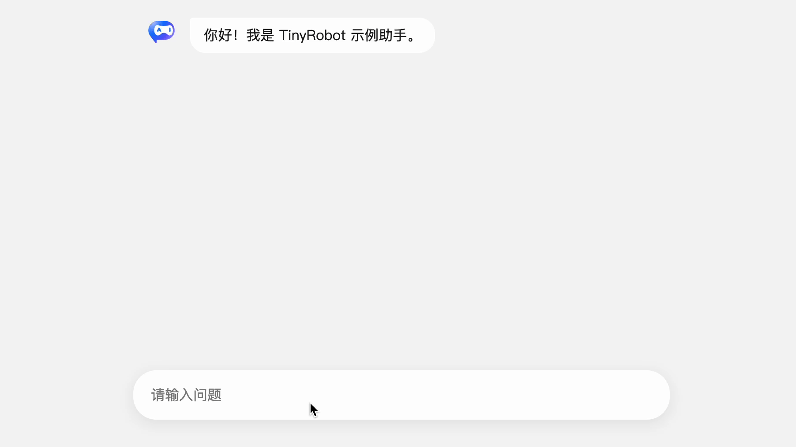

# 1

## 快速上手示例

### 安装

```bash
pnpm install @opentiny/tiny-robot @opentiny/tiny-robot-kit @opentiny/tiny-robot-svgs
```

入口引入样式：

```ts
import '@opentiny/tiny-robot/dist/style.css'
```

---

### 1. UI 层（组件示例）

> 开箱即用，只需简单配置，就能渲染完整 AI 聊天界面，并自动处理消息滚动、气泡显示和输入状态。

```vue
<template>
  <div class="chat-demo">
    <tr-bubble-list class="chat-list" :messages="messages" :role-configs="roles" auto-scroll />
    <tr-sender
      v-model="inputMessage"
      :placeholder="isProcessing ? '正在思考中...' : '请输入问题'"
      :loading="isProcessing"
      :clearable="true"
      @submit="handleSubmit"
      @cancel="abortRequest"
    />
  </div>
</template>

<script setup lang="ts">
import { TrBubbleList, TrSender, type BubbleRoleConfig } from '@opentiny/tiny-robot'
import { IconAi, IconUser } from '@opentiny/tiny-robot-svgs'
import { ref, h } from 'vue'
import { useChat } from './useChat'

const { messages, isProcessing, sendMessage, abortRequest } = useChat()
const inputMessage = ref('')

function handleSubmit(content: string) {
  if (!content || isProcessing.value) return
  sendMessage(content)
  inputMessage.value = ''
}

// 简洁角色配置：左右排列 + 头像
const roles: Record<string, BubbleRoleConfig> = {
  assistant: { placement: 'start', avatar: h(IconAi, { style: { fontSize: '32px' } }) },
  user: { placement: 'end', avatar: h(IconUser, { style: { fontSize: '32px' } }) },
}
</script>

<style scoped>
.chat-demo {
  max-width: 640px;
  width: 100%;
  margin: 0 auto;
  padding: 16px;
  display: flex;
  flex-direction: column;
  gap: 16px;
}
.chat-list {
  height: 400px;
}
</style>
```

---

### 2. 消息数据处理（Kit）

> Kit 自动管理消息状态、请求中状态和中止操作，无需手动处理复杂逻辑。

```ts
// useChat.ts
import { useMessage, sseStreamToGenerator } from '@opentiny/tiny-robot-kit'

export function useChat() {
  return useMessage({
    initialMessages: [{ role: 'assistant', content: '你好！我是 TinyRobot 示例助手。' }],
    responseProvider: async (requestBody, abortSignal) => {
      // 替换为你的大模型 API 地址
      const url = 'https://api.deepseek.com/chat/completions'
      const res = await fetch(url, {
        method: 'POST',
        headers: {
          'Content-Type': 'application/json',
          // 替换为你的大模型 API 密钥
          Authorization: `Bearer ${import.meta.env.VITE_API_KEY}`,
        },
        body: JSON.stringify({
          model: 'deepseek-chat',
          ...requestBody,
          stream: true,
        }),
        signal: abortSignal,
      })
      return sseStreamToGenerator(res, { signal: abortSignal })
    },
  })
}
```

---

### 3. 示例效果

完成上述步骤后，你即可获得一个完整的 AI 聊天界面，支持：

- 流式回复，实时展示助手回答
- 自动滚动，始终显示最新消息
- 输入框状态管理，包括加载状态和中止请求



更多 API 细节与组件用法，请参考 [TinyRobot 官方文档](https://docs.opentiny.design/tiny-robot/)
