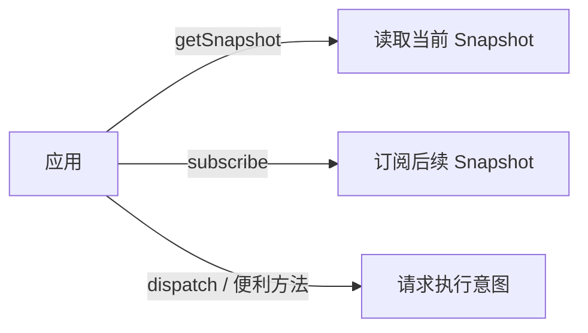
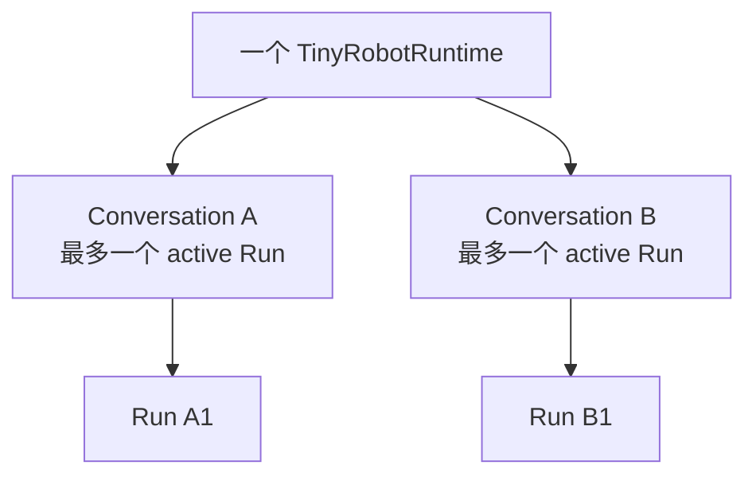

# Command 与 Runtime API

`TinyRobotRuntime` 是应用访问对话状态的唯一公共入口。应用可以读取当前状态、订阅变化，并提出“发送消息”或“停止生成”之类的请求，但不能直接改写对话数据。

本文把“当前完整状态”称为 **Snapshot**，把“外部提出的请求”称为 **Command**。可以先通过 [快速开始](../guide/quick-start.md) 建立整体印象。

## 三种交互



### `getSnapshot()`

返回当前 Runtime 实例已知的完整 Snapshot。调用者可以读取，但不能原地修改。

### `subscribe(listener)`

监听以后发布的新 Snapshot。它不是 Provider stream 订阅，也不会把 raw chunk 暴露给 UI。

### `dispatch(command)`

接受 Runtime 的标准请求消息。Command 说明调用方希望 Runtime 对哪个领域对象执行什么动作，并携带完成该动作所需的领域输入。Runtime 根据 Command 的 `type` 校验请求，再把它路由到对应的执行流程。

例如 `SendCommand` 的职责是请求 Runtime：在指定 Conversation 中记录一次用户输入，并使用指定的模型注册创建新的 Turn 和 Run。

## Command、Domain Event 与 Snapshot

| 概念         | 例子                               | 含义                             |
| ------------ | ---------------------------------- | -------------------------------- |
| Command      | `send`、`abort`                    | 调用者的意图，可能被拒绝         |
| Domain Event | `run-created`、`text-part-delta`   | Runtime 内部已经确认发生的事实   |
| Snapshot     | 当前 Conversation、Run、Message 等 | reducer 归约后的唯一领域事实来源 |

UI 不应该自己根据 Provider stream 重放状态，也不应该把 Command 当作已经成功的结果。

## Command 与 Run-local 输入

现行公共接口有两种发送方式：

```ts
await runtime.dispatch({
  type: 'send',
  conversationId: 'conversation-1',
  registrationId: 'deepseek-chat',
  content: '你好',
})
```

```ts
await runtime.send({
  conversationId: 'conversation-1',
  registrationId: 'deepseek-chat',
  content: '你好',
  credential,
})
```

这两个入口服务于同一个发送行为，但输入职责不同：

| 输入                   | 职责                                                                  | 消费者                          |
| ---------------------- | --------------------------------------------------------------------- | ------------------------------- |
| `SendCommand`          | 描述在哪个 Conversation 中记录什么用户输入，以及使用哪项模型注册      | `dispatch()` 的校验和执行流程   |
| `SendInput`            | 为便利方法收集同一组领域输入，并附带本次 Run 创建模型所需的执行上下文 | `send()`                        |
| `SendInput.credential` | 为当前 Run 创建 Provider model                                        | registration 的 `createModel()` |

`send()` 会把领域请求与 Run-local 执行上下文分开：领域字段形成与 `SendCommand` 相同的请求语义，credential 只交给当前 Run 的模型工厂。

`RuntimeCommand` 使用普通数据表示，是为了让 `dispatch()` 接收的标准请求不依赖函数、模型实例或 Provider SDK 对象。这是 Command 边界的表示约束，不是 `SendCommand` 的业务职责。

credential 的生命周期由 Run 执行边界负责。Runtime 只在创建本次模型时传递它，并在 Run 结束后释放相关引用。

## 并发边界



同一 Conversation 首期最多只有一个 active Run；不同 Conversation 可以并行。这条规则属于 Runtime，不应由组件通过禁用按钮来“碰巧保证”。

## 失败意味着什么

`dispatch()` 和便利方法返回 Promise。Promise resolve 只表示请求已被 Runtime 接受并完成其约定阶段，不代表 Provider 一定成功回答；最终 Run 状态仍从 Snapshot 读取。

具体的执行协调器（代码中称为 coordinator）、多个结果同时到达时的处理顺序，以及取消过程中的并发情况，属于后续任务。在这些行为实现前，文档不能承诺更细的完成时机。

## 命名来源

Command 借鉴 CQRS 中“表达业务意图而不是直接设置字段”的含义，但 Tiny Robot 并未因此采用完整 CQRS 架构。参见 [Microsoft CQRS pattern](https://learn.microsoft.com/en-us/azure/architecture/patterns/cqrs) 和[命名来源与项目定义](../reference/terminology-sources.md)。
