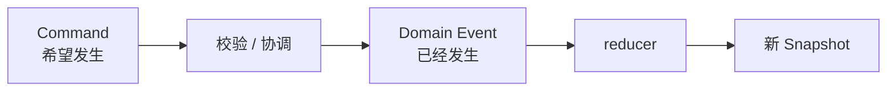
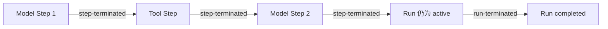
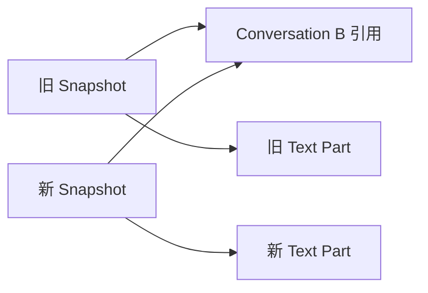

# Domain Event 与 reducer

Domain Event（下文简称 Event）表示 Runtime 内部已经确认发生的事实，例如“回答已经开始”或“一段文字已经到达”。reducer 是更新状态的函数：它接收旧 Snapshot 和一个 Event，计算并返回新 Snapshot。

文档把这个计算过程称为“归约”。它只是更新状态，不表示压缩或删除数据。基础概念可先查看 [快速开始](../guide/quick-start.md)。

```ts
reduceRuntimeEvent(snapshot, event): RuntimeSnapshot
```

reducer 必须是纯函数：不调用 Provider、不启动异步任务、不读取 credential、不修改旧 Snapshot，也不通知 UI。

Domain Event 借鉴领域驱动设计中“已经发生的领域事实”，reducer 借鉴单向状态管理中的纯状态计算。参见 [Microsoft Domain events](https://learn.microsoft.com/en-us/dotnet/architecture/microservices/microservice-ddd-cqrs-patterns/domain-events-design-implementation)、[Redux reducer 基础](https://redux.js.org/tutorials/fundamentals/part-3-state-actions-reducers) 和[命名来源与项目定义](../reference/terminology-sources.md)。

## Command 和 Event 不等价



例如 `abort` Command 只是“希望停止”的请求；只有后续执行流程确认回答确实停止后，内部终止 Event 才能把 Run 状态更新为 `aborted`（已中止）。负责串起这段流程的组件在后续任务中称为 coordinator（执行协调器）。

## Task 2 当前处理的事实

当前工作树的 reducer 覆盖最小文本生命周期：

| Event                  | 对 Snapshot 的影响                     |
| ---------------------- | -------------------------------------- |
| `conversation-created` | 创建 Conversation                      |
| `turn-created`         | 创建 Turn，并追加到 Conversation       |
| `run-created`          | 创建 pending Run，并设置 `activeRunId` |
| `step-started`         | 创建 Step，Run 进入 active             |
| `message-created`      | 创建输出 Message，并关联 Run           |
| `text-part-started`    | 创建 streaming Text Part               |
| `text-part-delta`      | 按到达顺序原样追加文本                 |
| `text-part-ended`      | Text Part 进入 completed               |
| `run-terminated`       | 当前实现同时终止 Step 与 Run           |

这些是内部事件，不属于 Runtime 公共导出，也不能直接等同于 AI SDK stream part。

## 文本追加为什么不能“顺便整理”

文本 delta 必须按观察顺序精确追加：

```text
"第一行" + "\n" + "第二行"
=
"第一行\n第二行"
```

reducer 不得 trim、重新分词、合并空格或改变换行。空 delta 不产生实际变化，可以返回原 Snapshot 引用。

## 不变量错误与幂等

当前处理规则是：

| 输入情况                                        | 结果                  |
| ----------------------------------------------- | --------------------- |
| 完全重复的 create/end Event                     | 幂等，返回原 Snapshot |
| 指向已经终止 Run 的迟到 Event                   | 不再改变 Snapshot     |
| 缺少被引用实体                                  | 抛出领域不变量错误    |
| Conversation/Turn/Run/Message/Part 所有权不一致 | 抛出领域不变量错误    |
| Step index 不连续                               | 抛出领域不变量错误    |

reducer 接收的是内部 Domain Event，因此所有权错误代表程序或适配器缺陷，不应静默吞掉。外部不可信数据应先由 Ingress Guard（响应检查关口）拒绝。

## Step 与 Run 为什么要分别终止

Step 终止表示“一次模型调用或工具执行已经结束”；Run 终止表示“针对这个 Turn 的整次回答尝试已经结束”。这是两个不同层级的事实。

当前 Task 2 的 `run-terminated` 同时接收 `stepId`、`stepStatus` 和 `runStatus`，并在一次归约中终止 Step 与 Run。它能表达单 Step 文本回答，但不能表达“Step 已结束而 Run 仍为 active”的多 Step 生命周期。

多 Step Run 的事件顺序必须拆成：



- `step-terminated` 结束一次模型调用或工具执行；
- `run-terminated` 结束整个执行尝试，不强制要求 `stepId`；
- 模型请求工具时，Model Step 已结束，但 Run 仍是 active；
- 最后一个 Model Step 也必须先独立终止，不能依靠 `run-terminated` 顺带结束；
- Run 可以在第一个 Step 创建前被取消。

独立的 Step 终止和工具循环由 Task 8 实现。在它完成前，当前 reducer 的可执行范围仍是 Task 2 的单 Step 文本生命周期。

## 结构共享示例

假设 Conversation A 收到一个文本 delta，而 Conversation B 没有变化：



新旧 Snapshot 可以共享 Conversation B；目标 Text Part 必须是新对象。永久回归测试应保护这种消费者可观察的不变量，而不是断言 reducer 内部调用顺序。
