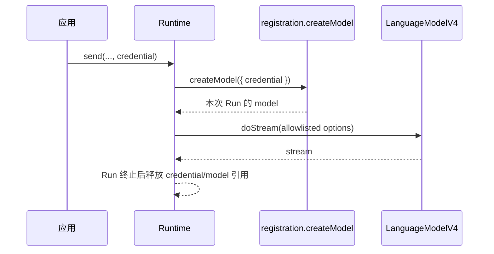
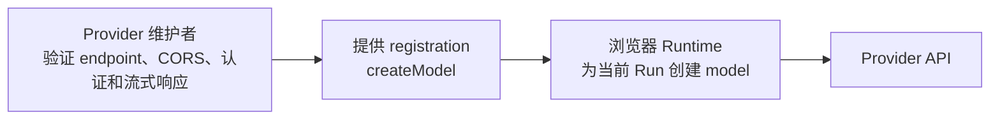
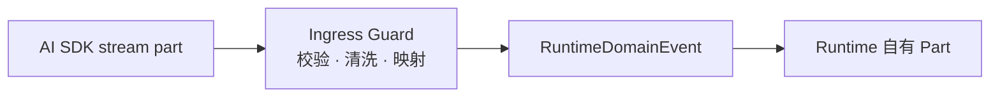
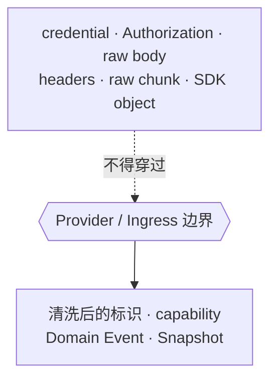

# 模型注册与安全边界

模型注册告诉 Runtime：“需要回答时，怎样创建一个可调用的模型”。它是应用必须信任的 Provider 扩展，由应用选择，由模型适配包或应用自己的 Provider 实现提供。

这里的 **Run** 是一次回答尝试，**Provider** 是模型服务适配层，**credential** 是 API key 一类的临时凭据，**capability** 是 Runtime 已确认可以依赖的模型能力。可以先通过 [快速开始](../guide/quick-start.md) 建立整体印象。Runtime 只保存不敏感的注册信息和能力声明，不保存创建函数、模型实例或凭据。

## Run-local 模型

credential 是不透明、瞬时、只属于当前 Run 的输入。Runtime 不得读取、复制、记录、持久化或通过 Snapshot 暴露它。

## 浏览器直连由 Provider registration 负责

Runtime v1 固定运行在浏览器，并直接请求 Provider API。registration 的实现能够接收 credential、选择 endpoint 和创建实际发出请求的 model，因此它的维护者负责确认这条浏览器直连路径可用。

应用选择一个 registration，表示它信任该实现接收当前 Run 的 credential，并信任其目标 endpoint。Runtime 消费已经通过准入的 registration。真实浏览器验证结果由 Provider conformance 测试、live verification 清单和支持文档承载。

对于应用自行接入的 OpenAI-compatible endpoint，接入方承担同样的验证责任。实际请求失败时，Runtime 接收并归一化 transport/protocol 结果。

## 为什么 RuntimePart 不复用 AI SDK 类型

`RuntimePart` 和 AI SDK 的 part 即使暂时长得相似，语义也不同：

| AI SDK / Provider part                 | RuntimePart                           |
| -------------------------------------- | ------------------------------------- |
| 表示边界输入或流协议成员               | 表示已经接受的领域内容                |
| 可能随上游版本增加联合成员             | 只随 Tiny Robot 公共契约演进          |
| 可能携带 Provider metadata 或 SDK 对象 | 必须可序列化、可持久化且安全          |
| 生命周期可能是 stream-local            | 生命周期属于 Runtime Message/Snapshot |

通过 `Pick`、`Omit` 或类型别名派生仍然会造成编译期和语义耦合。上游新增字段或联合成员时，Runtime 公共契约可能被动改变。

正确边界是显式转换：

图中的 Ingress Guard 是“响应检查关口”：它校验并清洗模型服务返回的数据，只把 Runtime 允许的内容交给后续状态处理。

这类有意的类型重复是防腐层。维护成本由两类测试控制：

- Provider/Ingress conformance 测试发现 AI SDK 升级差异；
- Runtime 公共类型和 reducer 测试保护稳定领域语义。

## Capability 描述模型调用语义

`RuntimeModelCapabilitiesV1` 表示经过评审、允许 Runtime 构造和解释模型调用的语义能力，例如 streaming、tools、reasoning 和 usage。Runtime 会根据这些能力决定某项请求能否执行，以及怎样解释可见结果。

一个 OpenAI-compatible endpoint 不能仅凭格式相似就推导 reasoning、usage 或 tool 能力。Provider mapping 必须通过对应的 conformance evidence 给出这些结论。

Run 创建时会冻结 registration 的非敏感标识、model ID 和模型语义 capability。后续 registration 修改不能悄悄改变已经存在的 Run。浏览器直连属于 registration 准入责任，不进入 Run capability 或 Snapshot。

## 必须停在边界外的数据

即使这些数据对调试很有帮助，也不能进入 Domain Event、Snapshot、日志、fixture、错误上报或 UI API。诊断需要单独的 allowlist，而不是保存原始响应以后再决定如何处理。

## 命名来源

`LanguageModelV4` 和 Provider 的基础角色来自 AI SDK；Tiny Robot 只采用经过契约批准的 ABI 子集。参见 [AI SDK `LanguageModelV4` 源码](https://github.com/vercel/ai/blob/main/packages/provider/src/language-model/v4/language-model-v4.ts)、[AI SDK Provider architecture](https://github.com/vercel/ai/blob/main/content/docs/02-foundations/02-providers-and-models.mdx) 和[命名来源与项目定义](../reference/terminology-sources.md)。
