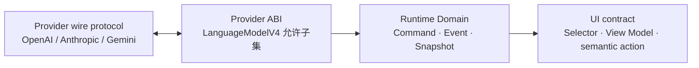
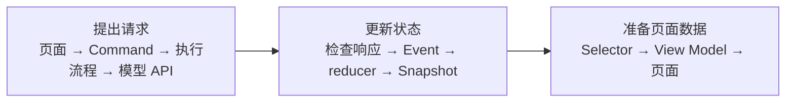

# Runtime 总览

Runtime 是应用里的对话管理对象。用户提出一个问题后，它负责记录这次问题属于哪段对话，创建一次回答尝试，接收经过检查的结果，并更新页面可以读取的状态。

文档把“一次回答尝试”称为 **Run**，把“Runtime 当前保存的全部对话状态”称为 **Snapshot**。如果这些概念还不熟悉，请先读 [快速开始](../guide/quick-start.md)。

Runtime 不依赖 Vue 或 Angular，也不是某个模型服务 SDK 的简单包装。

## 四层边界

| 层                     | 负责                                 | 不负责                       |
| ---------------------- | ------------------------------------ | ---------------------------- |
| Provider wire protocol | HTTP 请求、服务商原始响应            | Runtime 领域语义             |
| Provider ABI           | 固定版本 V4 调用与流事件形状         | 持久化状态、UI 状态          |
| Runtime Domain         | Conversation、Run、Snapshot 和不变量 | DOM、框架响应式对象          |
| UI contract            | 把 Snapshot 投影为组件需要的数据     | 修改 Snapshot、调用 Provider |

边界的意义不是多加几层代码，而是阻止某一层的变化自动扩散到其他层。例如 AI SDK 新增一个 stream part，不会自动让这个 part 变成可持久化的 Runtime 数据。

## 一次状态变化经过哪里

这里的词分别表示：Command 是外部请求，Event 是内部确认的事实，reducer 是更新状态的函数，Selector 是从完整状态中选取页面所需数据的函数。

阶段内的完整顺序是：

1. 页面操作 → Command → 执行流程 → 模型 API；
2. API 流式响应 → 响应检查关口 → Domain Event → reducer → 新 Snapshot；
3. Snapshot → Selector → 页面展示数据 → 页面。

关键点：后台 API 返回的数据不能直接修改 `RuntimeSnapshot`。原始响应必须先经过检查和清洗，再转换成 Domain Event；之后 reducer 才能产生新的 Snapshot。文档把这个计算过程称为“归约”。

## Snapshot 与 UI state 的关系

UI 面向领域的数据主要从 Snapshot 派生，例如：

- 当前 Conversation 的 Turn 顺序；
- 当前 active Run；
- 被采用的回答；
- 消息和 Part 的展示顺序；
- Run 是运行中、成功还是失败。

下面这些通常不是 Runtime 领域状态，应由 UI 自己维护：

- 当前选中的侧边栏项目；
- 输入框草稿；
- 焦点、滚动位置和弹窗开关；
- 只用于动画的瞬时标记。

## 当前 Task 范围

| 内容                                               | 状态                  |
| -------------------------------------------------- | --------------------- |
| Task 1：公共类型、Command、模型注册和 Runtime 接口 | **现行**              |
| Task 2：Domain Event、reducer、Snapshot 基础状态   | **现行**              |
| Task 3：capability preflight 和出站投影            | **后续任务**          |
| Task 4：响应检查关口（Ingress Guard）              | **后续任务**          |
| 模型适配、执行协调器（coordinator）、工具执行      | **不属于当前 Task 2** |

因此图中的完整链路用于解释架构职责，并不表示所有节点现在都已经实现。

## 下一步阅读

- [Command 与 Runtime API](./commands-and-runtime.md)
- [模型注册与安全边界](./model-registration.md)
- [Snapshot 与领域模型](./snapshot-and-domain-model.md)
