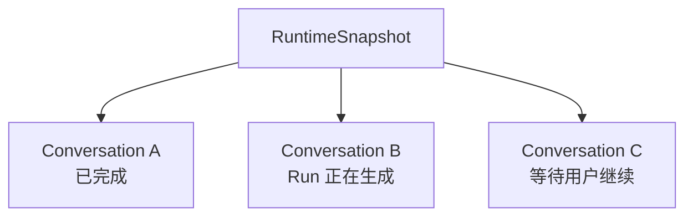
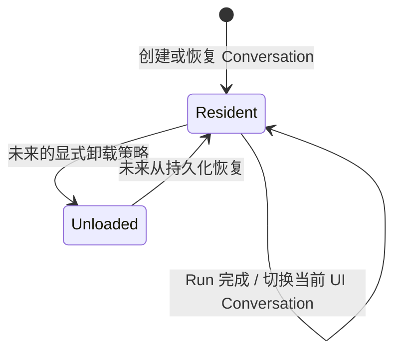
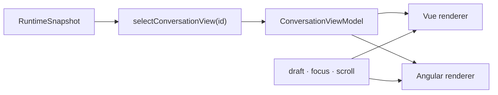

# Snapshot 与领域模型

可以把 Snapshot 理解为 Runtime 当前内存中的“状态总账”：页面想知道有哪些对话、问题和回答，都从这里读取。它不是后端数据库，也不一定包含用户历史上的所有对话。

`RuntimeSnapshot` 是**一个 `TinyRobotRuntime` 实例当前已知并驻留在内存中的完整、规范化领域状态**。

这一定义同时限定了三个范围：

- 它属于一个 Runtime 实例，不是全局单例；
- 它可以包含多个 Conversation，不是某一个 Conversation 的局部状态；
- 它只表示当前驻留数据，不等于持久化存储中的全部历史。

## Snapshot 的职责

`RuntimeSnapshot` 负责：

1. 保存 Runtime 当前接受的领域事实；
2. 用按 ID 规范化的实体表表达关系；
3. 为 Runtime 查询和 Selector 提供唯一领域事实来源；
4. 保持可序列化，不包含运行时对象；
5. 通过不可变更新和结构共享支持高效订阅。

它不负责：

- 保存 API key、header、raw payload、SDK object 或 opaque continuation；
- 保存输入框草稿、焦点、滚动位置等 UI 临时状态；
- 充当所有已持久化 Conversation 的永久内存缓存；
- 决定页面布局或组件展示形态。

## Snapshot 的顶层结构

`RuntimeSnapshot` 的顶层由一个版本号和七张实体表组成。下面就是当前公共类型的完整顶层形状；每张 `...ById` 表都使用实体 ID 作为 key，并保存对应类型的实体。

```ts
interface RuntimeSnapshot {
  readonly schemaVersion: 1
  readonly conversationsById: Readonly<Record<string, RuntimeConversation>>
  readonly turnsById: Readonly<Record<string, RuntimeTurn>>
  readonly runsById: Readonly<Record<string, RuntimeRun>>
  readonly stepsById: Readonly<Record<string, RuntimeStep>>
  readonly messagesById: Readonly<Record<string, RuntimeMessage>>
  readonly partsById: Readonly<Record<string, RuntimePart>>
  readonly toolCallsById: Readonly<Record<string, RuntimeToolCall>>
}
```

| 顶层字段            | 保存的实体                              | 主要用途                                  |
| ------------------- | --------------------------------------- | ----------------------------------------- |
| `conversationsById` | Runtime 当前驻留的 Conversation         | 找到一段对话及其有序 `turnIds`            |
| `turnsById`         | 每次用户意图及其所有回答尝试            | 找到有序 `runIds` 和当前选中的 Run        |
| `runsById`          | 每次完整回答尝试                        | 读取状态、冻结的模型信息、Step 和 Message |
| `stepsById`         | Run 中的模型调用或工具执行              | 读取执行顺序、种类和状态                  |
| `messagesById`      | system、user、assistant 或 tool Message | 按 `partIds` 读取消息内容                 |
| `partsById`         | Text、Reasoning、ToolCall 或 Error Part | 读取最终可展示或可投影的内容              |
| `toolCallsById`     | Runtime 管理的客户端工具请求            | 读取参数、审批和执行状态                  |

下面的简化 JSON 只保留 ID 和关系字段，用来展示一条 Conversation → Turn → Run → Message → Part 关系实际怎样分散存进不同的表。它不是可直接复制的完整 `RuntimeSnapshot`；Run 的状态、模型信息和 capability 等字段在这里省略。

```json
{
  "conversationsById": {
    "conversation-1": {
      "id": "conversation-1",
      "turnIds": ["turn-1"]
    }
  },
  "turnsById": {
    "turn-1": {
      "id": "turn-1",
      "conversationId": "conversation-1",
      "runIds": ["run-1"],
      "selectedRunId": "run-1"
    }
  },
  "runsById": {
    "run-1": {
      "id": "run-1",
      "turnId": "turn-1",
      "stepIds": ["step-1"],
      "messageIds": ["message-1"]
    }
  },
  "stepsById": {
    "step-1": {
      "id": "step-1",
      "runId": "run-1"
    }
  },
  "messagesById": {
    "message-1": {
      "id": "message-1",
      "turnId": "turn-1",
      "runId": "run-1",
      "partIds": ["part-1"]
    }
  },
  "partsById": {
    "part-1": {
      "id": "part-1",
      "messageId": "message-1"
    }
  },
  "toolCallsById": {}
}
```

以第一张表为例，`conversation-1` 是表的 key，也是实体自己的 `id`；它的 `turnIds` 保存 `turn-1`，因此下一步去 `turnsById["turn-1"]` 取实体。其他关系按相同方式逐层查表。数组保存顺序，实体表保存内容，父实体不会内嵌一份子实体副本。

## 一个 Runtime 可以同时有多个 Conversation

Conversation 指一段可以连续追问的对话；Run 指针对某个问题的一次回答尝试。其他实体可以先从 [快速开始](../guide/quick-start.md) 了解。



不同 Conversation 可以并行推进。`getSnapshot()` 没有 `conversationId` 参数，因为它返回整个 Runtime 的状态；Selector 再从中选择某个 Conversation 的视图。

## 回答完成后会自动释放吗

**当前不会。** Run 回答完成后，Conversation、Turn、Run、Message 和 Part 仍留在当前 Snapshot 中，使 UI 可以继续展示结果，也使后续上下文投影有数据可读。

新的 Conversation 被创建时，旧 Conversation 不会因为“当前页面切换了”而自动删除。



显式卸载、容量上限、LRU cache、分页加载和持久化恢复策略尚未设计。本轮不能假定存在自动释放逻辑。销毁整个 Runtime 实例时，其内存引用当然可以随实例一起释放，但这不是 Conversation 级领域事件。

## 为什么用 ID 表而不是深层嵌套

上面的顶层结构把每类实体分别放进一张 ID 表。如果改成把 Turn、Run、Message 和 Part 全部嵌套在 Conversation 内，追加一个文本 delta 可能需要复制整条对象树。规范化表让 reducer 只替换真正变化的表和实体。

例如只向一个文本 `RuntimePart` 追加内容时：

- `partsById` 和目标 Part 获得新引用；
- 未变化的 Conversation、Turn、Run、Step 和 Message 保持原引用；
- Snapshot 本身获得新引用，订阅者知道状态已变化。

这就是结构共享，不是原地修改。

按实体类型建立 ID 表、通过 ID 数组保存顺序的方式借鉴了 [Redux 的规范化状态模式](https://redux.js.org/usage/structuring-reducers/normalizing-state-shape)。`RuntimeSnapshot` 的数据范围和实体关系仍是 Tiny Robot 自己的领域定义，详见[命名来源与项目定义](../reference/terminology-sources.md)。

## UI 如何使用 Snapshot



Snapshot 是领域事实来源，但并不意味着 UI 所有 state 都塞进 Snapshot。Selector 是无副作用投影；Vue/Angular 可以分别用自己的响应式机制消费同一个 View Model 契约。

完整场景见[一次文本回答](../examples/completed-text-run.md)和[多个 Conversation](../examples/multiple-conversations.md)。多 Step 工具循环、Regenerate 和 Selector 聚合会在对应后续 Task 进入文档，不提前扩展当前 Task 2 的状态契约。
