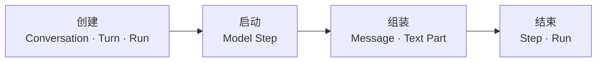
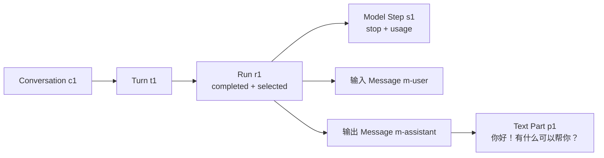

# 示例：一次完成的文本回答

用户在一段对话（Conversation）中发送“你好”，模型返回“你好！有什么可以帮你？”。Runtime 为这次回答创建一个 Run，也就是一次回答尝试。本文展示状态更新函数 reducer 怎样记录整个过程；不熟悉这些概念时可先阅读 [快速开始](../guide/quick-start.md)。

## 过程



对应的 Event 顺序是：

1. `conversation-created` → `turn-created` → `run-created`；
2. `step-started`；
3. `message-created` → `text-part-started` → 一个或多个 `text-part-delta` → `text-part-ended`；
4. `run-terminated`，同时携带当前 `stepId`、`stepStatus` 和 `runStatus`。

第 4 项是 Task 2 当前实现的单 Step 终止方式：同一个 Event 同时把最后一个 Step 和整个 Run 写成终态。它只适用于“当前 Step 结束时，Run 也随之结束”的流程。

最终的多 Step Run 必须把两层事实拆开。最后一个 Step 也有自己的终止 Event，然后才结束 Run：

```text
step-terminated(stepId: "step-final", stepStatus: "completed")
run-terminated(runId: "run-1", runStatus: "completed")
```

当前 Task 2 尚不能表达“一个 Step 已结束，但 Run 继续 active”。独立的 `step-terminated` 以及工具调用后的后续 Step 属于 Task 8 的实施范围；在那之前，不能把本示例解释成已经支持多 Step 执行。

## 最终关系



## Snapshot 片段

下面是便于评审关系的**提议结构示意**，不能直接复制为当前 API。与场景无关的 capability 字段和空表被折叠。

```ts
const snapshot = {
  schemaVersion: 1,

  conversationsById: {
    c1: {
      id: 'c1',
      turnIds: ['t1'],
      // Run 已完成，所以没有 activeRunId。
    },
  },

  turnsById: {
    t1: {
      id: 't1',
      conversationId: 'c1',
      runIds: ['r1'],
      selectedRunId: 'r1',
    },
  },

  runsById: {
    r1: {
      id: 'r1',
      turnId: 't1',
      status: 'completed',
      stepIds: ['s1'],
      inputMessageIds: ['m-user'],
      outputMessageIds: ['m-assistant'],
      provider: 'example-provider',
      modelId: 'example-model',
      capabilities: capabilitiesFrozenForRun,
      termination: 'stop',
    },
  },

  stepsById: {
    s1: {
      id: 's1',
      runId: 'r1',
      index: 0,
      kind: 'model',
      status: 'completed',
      termination: 'stop',
      usage: { inputTokens: 6, outputTokens: 10 },
    },
  },

  messagesById: {
    'm-user': {
      id: 'm-user',
      turnId: 't1',
      role: 'user',
      partIds: ['p-user'],
    },
    'm-assistant': {
      id: 'm-assistant',
      turnId: 't1',
      runId: 'r1',
      role: 'assistant',
      partIds: ['p1'],
    },
  },

  partsById: {
    'p-user': {
      id: 'p-user',
      messageId: 'm-user',
      kind: 'text',
      content: '你好',
      status: 'completed',
    },
    p1: {
      id: 'p1',
      messageId: 'm-assistant',
      kind: 'text',
      content: '你好！有什么可以帮你？',
      status: 'completed',
    },
  },

  toolCallsById: {},
}
```

## UI 得到什么

Selector 可以从 `selectedRunId` 找到 `r1`，再按 `outputMessageIds` 和 `partIds` 生成当前回答的 View Model。UI 不需要理解 Provider stream，也不需要保存另一份回答状态机。

## 明确不会出现什么

Snapshot 中不会出现 API key、Authorization header、Provider 原始 request/response、AI SDK object、原始错误对象或 UI 草稿/焦点/滚动状态。

## 回归保护

当前工作树中的以下永久测试保护场景的现行部分：

- `test/reducer/run-lifecycle.test.ts`：实体创建和终态；
- `test/reducer/content-parts.test.ts`：文本精确追加和结束；
- `test/reducer/structural-sharing.test.ts`：不可变更新和引用稳定。

提议字段在批准并实现前没有对应公共 API 类型检查，不能当作已验证契约。
