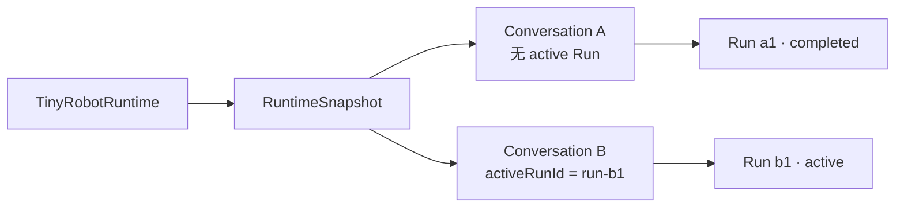
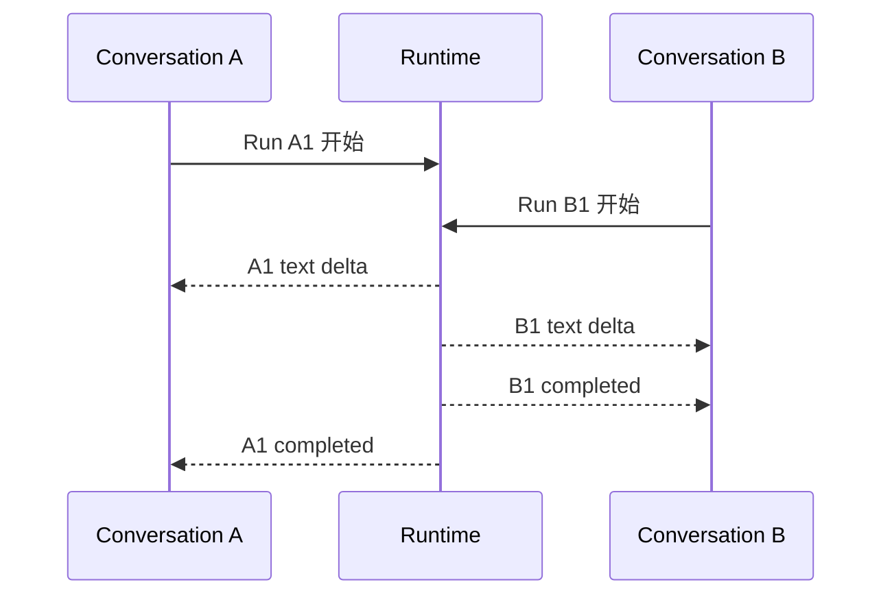

# 示例：多个 Conversation

Conversation 是一段可以连续追问的对话。一个 RuntimeSnapshot（Runtime 当前内存中的状态总账）可以同时包含多段当前已加载的 Conversation。切换页面正在显示的对话，不会删除其他 Conversation。不熟悉这些概念时可先阅读 [快速开始](../guide/quick-start.md)。

## 场景

- Conversation A 已经回答完成；
- 用户切换到 Conversation B，并开始新的 Run；
- Conversation A 仍保留在 Snapshot 中；
- A 和 B 的实体通过 ID 所有权隔离。



## UI 切换不会改变领域状态

```ts
const uiState = {
  selectedConversationId: 'conversation-b',
}

const snapshot = runtime.getSnapshot()

snapshot.conversationsById['conversation-a'] // 仍然存在
snapshot.conversationsById['conversation-b'] // 正在执行
```

`selectedConversationId` 属于 UI state，不需要写入 RuntimeSnapshot。Selector 用它选择需要展示的 Conversation。

## 两个 Conversation 可以并行

不同 Conversation 可以各自有一个 active Run：



同一 Conversation 则最多一个 active Run。这个不变量防止两个回答同时争夺相同 Turn 和上下文。

## 回答完成后是否释放

Run B1 完成只会清除 Conversation B 的 `activeRunId` 并保留其结果，不会自动删除 Conversation A 或 B。

未来若增加 unload：

- 必须是显式 Runtime 能力或明确 cache policy；
- 必须说明未保存数据能否丢失；
- 必须与持久化恢复和 UI 选择状态配合；
- 不能由 reducer 在“新 Conversation 创建”时隐式猜测。

这部分尚未进入当前契约或 Task 2 实现。

## 边界场景：A 的 Event 错指向 B

如果一个携带 `run-a1` 的 Event 试图修改 Conversation B 所属的 Message/Part，reducer 必须把它视为所有权不变量错误，而不是仅凭 ID 存在就接受。

当前 Task 2 的 ownership 回归测试用于防止这种跨 Conversation/Run 状态污染。
