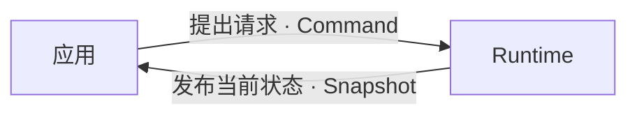
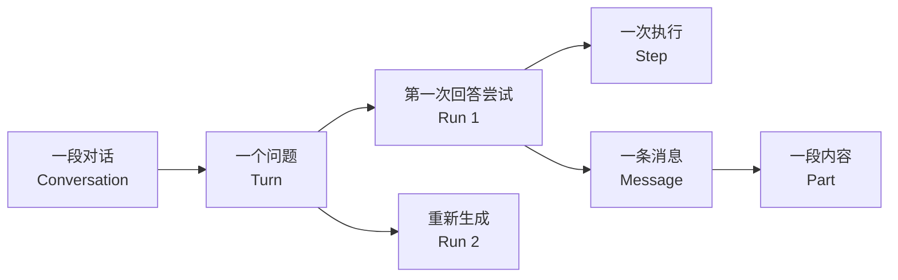
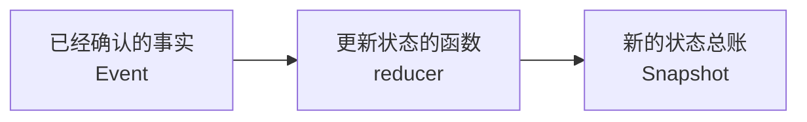

# 快速开始

本页按照实施计划的进度介绍概念。当前只覆盖已经进入评审的 Task 1 和 Task 2；后续任务需要的新名词，会在对应任务进入评审时再加入学习路径。

读完后，你应该能回答三个问题：应用怎样访问 Runtime、一次问答由哪些对象组成、模型返回内容后状态怎样变化。

## Task 1：先理解公共边界

假设用户在聊天窗口里问：“北京今天天气怎么样？”应用不会直接修改对话数据，而是通过 Runtime 提出请求并读取结果。

| 文档中的词                           | 先这样理解                                                   | 在示例中是什么                     |
| ------------------------------------ | ------------------------------------------------------------ | ---------------------------------- |
| **Runtime**                          | 应用里的对话管理对象。它接收请求、推进回答流程并管理对话状态 | 管理聊天窗口背后数据的对象         |
| **Command**                          | 应用向 Runtime 提出的请求，不保证一定成功                    | “发送这个问题”“停止生成”           |
| **RuntimeSnapshot**（简称 Snapshot） | 一个 Runtime 此刻保存在内存中的全部对话状态                  | 页面读取问题、回答和运行状态的总账 |

应用和 Runtime 的公共关系可以先记成：

Runtime 还需要知道怎样调用模型，但不能长期保存 API key 或某个模型实例。

| 文档中的词                         | 先这样理解                                                           |
| ---------------------------------- | -------------------------------------------------------------------- |
| **模型注册（Model Registration）** | 应用必须信任的 Provider 扩展；负责为本次回答创建适合浏览器使用的模型 |
| **Provider**                       | 把统一的模型调用方式适配到具体模型服务                               |
| **LanguageModelV4**                | Task 1 固定使用的 AI SDK 模型调用接口                                |
| **credential**                     | API key 一类的临时凭据；只用于当前回答，不能进入 Snapshot            |
| **capability**                     | Runtime 构造模型调用时依赖的语义能力，例如是否支持工具调用           |

这些名称的来源并不相同：`LanguageModelV4` 和 Provider ABI 直接来自 AI SDK；Command 借用 CQRS 中表达业务意图的概念；`RuntimeSnapshot` 的具体数据范围由 Tiny Robot 自己定义。出处和差异见[命名来源与项目定义](../reference/terminology-sources.md)。

::: tip 继续阅读 Task 1
**中文设计说明：** [Runtime 总览](../concepts/runtime-overview.md) · [Command 与 Runtime API](../concepts/commands-and-runtime.md) · [模型注册与安全边界](../concepts/model-registration.md)

**正式设计依据：** [下一代架构总览](../design/architecture-overview.md) · [ADR-0002：Provider 边界](../design/adr-0002-language-model-v4-provider-boundary.md) · [Runtime 契约](../design/runtime-contract.md) · [LanguageModelV4 Boundary Contract v1](../design/language-model-v4-runtime-boundary-v1.md)

**实施范围（临时工作材料）：** [计划 Task 1](../design/implementation-plan.md#task-1-approve-package-boundaries-and-pin-the-public-abi) · [计划 Task 1.1](../design/implementation-plan.md#task-1-1-document-the-public-abi-and-enforce-generated-api-documentation)
:::

## Task 2：再理解一段问答的数据

Task 2 为 Snapshot 增加规范化领域状态。仍以天气问题为例：

| 文档中的词       | Tiny Robot 中的定义                    | 在示例中是什么                             |
| ---------------- | -------------------------------------- | ------------------------------------------ |
| **Conversation** | 一段可以连续追问的对话                 | 用户与助手关于天气的整段聊天               |
| **Turn**         | 用户提出的一次问题或意图               | “北京今天天气怎么样？”                     |
| **Run**          | Runtime 为一个 Turn 生成答案的一次尝试 | 第一次回答；点击“重新生成”会创建另一次 Run |
| **Step**         | Run 中一次模型调用或一次工具执行       | 调用模型生成天气回答                       |
| **Message**      | 由用户、助手或工具产生的一组内容       | 用户的问题，或助手的完整回答               |
| **Part**         | Message 中最小的内容单元               | 一段文字、一次工具请求或一个错误           |

它们之间最常见的关系是：

同一个 Turn 可以有多个 Run，因为同一个问题可以重新生成。一次 Run 也可以有多个 Step，因为后续工具流程可能多次调用模型或工具。

Conversation、Turn、Run 和 Step 在不同产品中没有统一层级；上表是 Tiny Robot 的项目定义。Message 和 Part 借鉴 AI SDK 的内容结构，但 Runtime 类型不会直接复用 AI SDK 类型。

## Task 2：状态怎样变化

| 文档中的词                     | 直白定义                                             | 例子                                    |
| ------------------------------ | ---------------------------------------------------- | --------------------------------------- |
| **Domain Event**（简称 Event） | Runtime 内部已经确认发生的事实                       | “Run 已创建”“文字已追加”                |
| **reducer**                    | 根据“旧 Snapshot + 一个 Event”计算新 Snapshot 的函数 | 收到“文字已追加”后，把文字加入对应 Part |

文档把“reducer 根据 Event 产生新 Snapshot”简称为**归约**。这个词只描述状态计算，不表示压缩或删除数据。

Domain Event 借用领域驱动设计中“已经发生的领域事实”这一含义；reducer 和按 ID 组织状态的方式借鉴 Redux 的状态管理模式。Tiny Robot 仍为事件内容、实体所有权和生命周期定义自己的约束。

::: tip 继续阅读 Task 2
**中文设计说明：** [Snapshot 与领域模型](../concepts/snapshot-and-domain-model.md) · [Domain Event 与 reducer](../concepts/events-and-reducer.md) · [一次完成的文本回答](../examples/completed-text-run.md) · [多个 Conversation](../examples/multiple-conversations.md)

**正式设计依据：** [ADR-0004：Snapshot、Command 与 Domain Event 分工](../design/adr-0004-snapshot-command-event-runtime.md) · [Runtime 契约](../design/runtime-contract.md) · [LanguageModelV4 Boundary Contract v1](../design/language-model-v4-runtime-boundary-v1.md#1-决策与分层)

**实施范围（临时工作材料）：** [计划 Task 2](../design/implementation-plan.md#task-2-define-normalized-snapshot-domain-events-and-reducer-invariants)
:::

## 跨 Task 参考

- 想核对名词依据：阅读 [命名来源与项目定义](../reference/terminology-sources.md)。
- 想查看已经实现的公共类型：阅读 [Runtime API 与 TSDoc](../reference/runtime-api.md)。
- Task 3 及后续任务进入评审时，再在对应章节加入同样的中文说明、正式设计依据和实施范围入口。
