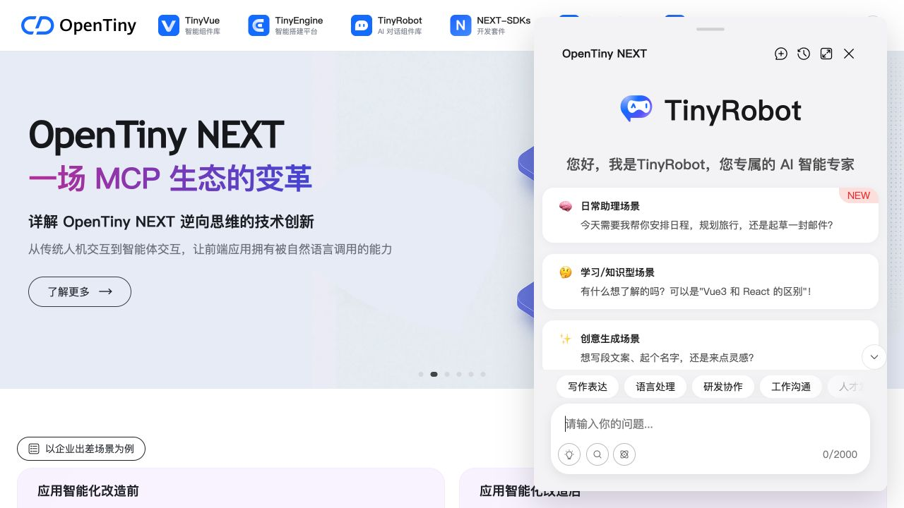
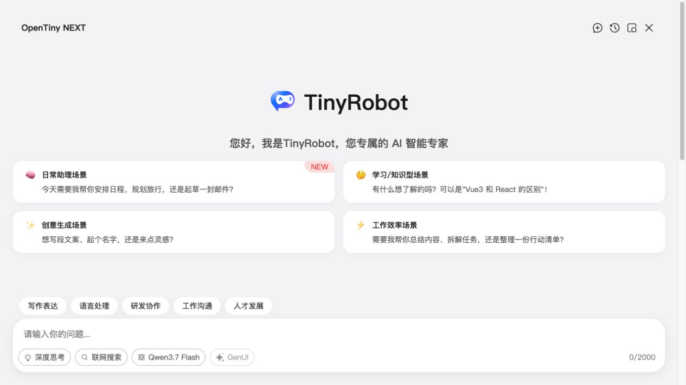

# Agent + Skill 操作手册

本路线让编程 Agent 使用 `opentiny-ai-app-integration` Skill 修改现有 Vue 3 + Vite 业务应用。Codex 是当前完整重放基线；其他 Agent 产品可以沿用提示词和验收门槛，但其 Skill 发现方式、审批机制、终端和浏览器能力需要按产品调整。

## 环境要求

### Agent 产品

- 能访问目标仓库、运行终端命令、编辑源码并查看 Git diff。
- 能加载 `opentiny-ai-app-integration` Skill。Codex 中可在提示词使用 `$opentiny-ai-app-integration`。
- 能运行真实浏览器验证；如果产品没有浏览器能力，由开发者人工完成 UI checklist。
- 能在依赖安装、启动本地端口等动作前请求用户批准。

### 目标应用

- 已存在的 Vue 3 + Vite 应用，不是新建 demo。
- Node.js `>=20.13.0`；本次验证使用 `v22.23.1`。
- Git 已跟踪当前基线，开发者知道哪些 dirty 文件必须保留。
- 当前应用拥有自己的 `package.json` 和可核对的 lockfile。本次基线为 `pnpm-lock.yaml`、`lockfileVersion: '9.0'`。
- macOS 已验证；Linux 命令未重放；Windows 未验证。

### 本地 CLI

当前流程依赖本地修改的 CLI 源码：

```bash
node <TINY_ROBOT_REPO>/packages/cli/bin/cli.js add chat
```

本次实际命令是：

```bash
node /Users/gene/Projects/tiny-robot/packages/cli/bin/cli.js add chat
```

::: danger RELEASE-BLOCKER: LOCAL_CLI
本地 package 声明 `@opentiny/tiny-robot-cli@0.5.2-alpha.11`，尚不能把文档命令替换为 `pnpm dlx`/`npx`。CLI 发布后必须锁定精确版本、删除本地仓库要求、从干净项目重放，并更新本手册的版本、日期和验证证据。
:::

## Agent 工作协议

Agent 必须按下面顺序执行，不能看到 `TinyRobotChat.vue` 就直接声称完成：

```text
READ_ONLY_PREFLIGHT
  → USER_CONFIRMED
  → CLI_GENERATED
  → DEPENDENCIES_RESOLVED
  → APP_MOUNTED
  → BUILD_VERIFIED
  → UI_VERIFIED
  → USER_CONFIRMED
  → GENUI_CODE_INTEGRATED
  → GENUI_TESTS_VERIFIED
  → BUILD_VERIFIED
  → UI_VERIFIED
  → USER_CONFIRMED
  → WEBMCP_CONTRACT_VERIFIED
  → WEBMCP_UI_VERIFIED
  → USER_CONFIRMED
  → PAGETOOL_CONTRACT_VERIFIED
  → PAGETOOL_UI_VERIFIED
```

每次执行命令前，Agent 应说明目的和完整命令。每次执行后应记录 exit code、关键输出、允许警告、失败状态和实际文件差异。

Agent 不得：

- 读取、删除、覆盖、回显或提交真实 `.env`；文件存在也只记录文件名。
- 使用 `create`、第二个聊天框、手写聊天壳、mock schema 卡片或假服务绕过真实接入。
- 用 build 成功替代浏览器证据或真实服务证据。
- 擅自提交业务仓库。完成一个阶段后可以建议 Git checkpoint，但必须等用户明确授权。

## 1. 发起 Step 1

使用 [Step 1 提示词](./prompts/step-1-add-chat)。第一轮只允许 Agent 做只读预检：

```bash
pwd
git rev-parse --show-toplevel
git status --short
test -f package.json && node -e "const p=require('./package.json'); console.log(JSON.stringify({name:p.name,dependencies:p.dependencies,devDependencies:p.devDependencies},null,2))"
rg --files -g 'vite.config.*' -g 'src/**' -g 'pnpm-lock.yaml' -g 'package-lock.json' -g 'pnpm-workspace.yaml'
```

你需要核对 Agent 的报告：

- 目标目录确实是业务应用，而不是父 workspace。
- dirty 文件清单完整；Agent 明确承诺保留它们。
- 包管理器和当前应用 lockfile 边界清楚。
- CLI 目标文件不会覆盖已有或 dirty 文件。
- Agent 没有读取 `.env`。

确认后，再让 Agent执行本地 CLI。

## 2. 验收 Step 1

Agent 应报告 CLI 的真实行为：

- 创建 `src/TinyRobotChat.vue`。
- 创建 `src/tiny-robot-chat/components/ComposerTools.vue`。
- 创建 `src/tiny-robot-chat/components/WindowHeader.vue`。
- 创建 `src/tiny-robot-chat/composables/useWindow.ts`。
- 创建 `src/tiny-robot-chat/config/chat-runtime.ts`。
- 创建 `src/tiny-robot-chat/config/chat-ui.ts`。
- 创建或合并 `.env.example`，但不创建 `.env`。
- 给 `package.json` 添加 TinyRobot `0.5.2-alpha.10` 和 `@vueuse/core@13.9.0`。
- 不安装依赖、不修改 lockfile、不修改 `main.js/main.ts`、不自动挂载组件。

Agent 还必须完成 CLI 之外的工作：

1. 在真实 `App.vue`/路由页面唯一挂载 `<TinyRobotChat />`。
2. 执行当前应用的依赖安装，让 package 和 lockfile 同步。
3. 核对 `TrThemeProvider`、`TrChat` 和 TinyRobot styles 的有效导入。
4. 运行生产构建。
5. 启动本地页面，在浏览器打开 TinyRobot，并确认错误日志为空。



只有这些证据齐全，才接受 `TINYROBOT_INTEGRATED + BUILD_VERIFIED + UI_VERIFIED`。模型 key 未提供或未发送真实请求时，继续保留 `CONFIG_PENDING`/`SERVICE_UNVERIFIED`。

## 3. 确认进入 Step 2

Step 1 验收后再使用 [Step 2 提示词](./prompts/step-2-genui)。Agent 必须重新做只读证据门检查，不能默认 Step 1 一定正确。

确认 Agent 的实施计划包含：

- GenUI SDK 三个包统一为 `1.3.0`。
- 复用 Skill 的 `assets/genui-v1.3.0/`，不依赖 `robot-client`。
- 保持唯一 `TrChat`。
- GenUI 在 `sender-footer` 中作为默认关闭的功能开关。
- `PatternExtractor` 跨 chunk 解析；只将有效 `schema-card` 交给 `GenuiRenderer`。
- 普通/GenUI 请求动态路由；没有 mode allowlist 时切换前后保持 selected model，有明确策略时选项、selected ID 和真实请求共同遵循 allowlist。
- GenUI 认证与模型供应商 key 隔离。
- 只写 `.env.example` 空占位。

## 4. 验收 Step 2

要求 Agent 提供以下命令和结果：

```bash
diff -ru <SKILL_DIR>/assets/genui-v1.3.0/genui src/tiny-robot-chat/genui
node --experimental-strip-types --test tests/genui-integration.test.mjs
pnpm build
```

通用模板测试至少覆盖五项：

1. schema 跨 chunk 仍能被解析。
2. Markdown 和 `schema-card` 顺序不丢失。
3. GenUI 开关通过 TinyRobot `sender-footer` 渲染。
4. 请求路由保留 selected model。
5. GenUI 请求不转发模型供应商 key。

宿主项目还应验证 `ChatModelRuntime.options` 是 `Ref`/`ComputedRef`。如果传入 plain array，`model.options.value` 会变成 `undefined`，浏览器中原有的深度思考、联网搜索和模型选择器会一起消失。

浏览器验收：

- GenUI 与原有工具并列，而不是替换它们。
- 默认 `aria-pressed="false"`。
- 缺 URL/Prompt ID 时原生 `disabled`，title 提示具体变量。
- 没有 mode allowlist 时开关切换不改变当前模型；有明确策略时，UI 显示模型与真实请求模型必须一致落在当前模式允许范围。
- 样式与相邻按钮高度、圆角、字号和颜色一致。
- 页面错误日志为空。



## 5. 区分代码、配置和服务状态

当 Agent 没有真实服务合同和授权时，正确结果是：

```text
CODE_INTEGRATED
BUILD_VERIFIED
UI_VERIFIED
CONFIG_PENDING
SERVICE_UNVERIFIED
```

只有 endpoint、Prompt ID、认证方式均由用户提供，并且真实请求返回有效 `schema-card` 且在浏览器渲染，才能升级为 `SERVICE_VERIFIED`。使用占位 URL、静态 JSON、mock response 或本地卡片都不算。

## 6. 执行和验收 Step 3

使用 [Step 3 提示词](./prompts/step-3-webmcp-skill)。Agent 第一轮只能恢复当前 TinyRobot、GenUI、模型策略和页面业务能力，不能先写一个通用工具再寻找使用场景。

### 6.1 环境和证据门

除前两步环境外，Agent 还需要：

- 目标项目能解析兼容的 `@opentiny/next-sdk`；验证版本为 `0.4.2`。
- 当前浏览器支持 `document.modelContext`，或 Next SDK 能在目标运行环境初始化其 polyfill/bridge。
- 唯一 `TrChat` 已能使用当前模型服务发送请求；自然语言 UI 验收需要用户已完成的 endpoint 和认证配置，但 Agent 不读取或回显配置值。
- 目标页面已有可观察、可测试、由稳定业务 ID 驱动的真实状态。

建议只读命令：

```bash
pwd
git rev-parse --show-toplevel
git status --short
node -e "const p=require('./package.json'); console.log(JSON.stringify({dependencies:p.dependencies,devDependencies:p.devDependencies},null,2))"
rg -n "TrChat|useLocalChatRuntime|mcp|skillPlugin|modelContext|initializeBuiltinWebMCP" src tests
rg -n "registerTool|listTools|getTools|executeTool" node_modules/@opentiny/next-sdk -g '*.ts' -g '*.d.ts' -g '*.js'
```

Agent 应先报告：

- TinyRobot、GenUI 和宿主模型策略的当前状态；
- 可选业务能力、稳定 ID、真实状态入口和用户可观察结果；
- Next SDK 的实际版本、导出和浏览器 API；
- 计划新增的工具、schema、annotations、错误和测试；
- 可能重叠的 dirty 文件。

以下情况必须暂停：

- 找不到真实业务状态，只能写 mock、日志或静态回复；
- 业务能力依赖用户未提供的合同、endpoint、认证或人工配置；
- 当前安装版本没有可证实的注册或执行 API；
- 目标文件已有无法安全合并的 dirty 修改。

### 6.2 实施边界

确认后，Agent 应：

1. 先写工具合同、业务状态和错误场景测试。
2. 把业务状态从纯视觉组件中提取为页面与工具共同使用的真实状态源。
3. 初始化内置 WebMCP，并通过 `document.modelContext.registerTool` 注册工具。
4. 从浏览器的 `listTools()` 或兼容的 `getTools()` 获取真实 descriptor，再通过 `executeTool(descriptor, JSON.stringify(args))` 执行。
5. 在 TinyRobot MCP adapter 中给模型暴露 `<server-id>__<tool-name>`，同时保留原工具名执行。
6. 增加业务 Skill，说明能力、意图映射、参数、返回值、限制、错误和反馈。
7. 复用唯一 `TrChat`，保留 GenUI、普通文本和宿主模型策略。

`opentiny.design.home` 的已验证工具合同是：

| 原工具名 | TinyRobot 可见名 | 参数 | 结果与限制 |
| --- | --- | --- | --- |
| `list_opentiny_showcases` | `opentiny-page__list_opentiny_showcases` | `{}` | 返回当前展示 ID 与六项可展示能力；只读 |
| `show_opentiny_showcase` | `opentiny-page__show_opentiny_showcase` | `{ "showcaseId": <enum> }` | 切换真实轮播状态并暂停自动轮播；不提交、删除或打开外部链接 |

稳定 ID 为 `enterprise-ai`、`webmcp-ecosystem`、`gosim-2025`、`tinyvue-space`、`tinyengine-material-import`、`genui-sdk`。这些 ID 属于验证项目，其他项目必须从自身业务模型选择，不能照抄。

### 6.3 文件和测试验收

验证项目对应文件：

```text
src/business/opentiny-showcases.ts
src/webmcp/register-business-tools.ts
src/tiny-robot-chat/webmcp/builtin-webmcp-adapter.ts
src/tiny-robot-chat/skills/opentiny-showcase.ts
src/components/HeroCarousel.vue
src/main.js
src/TinyRobotChat.vue
tests/webmcp-business.test.mjs
package.json
pnpm-lock.yaml
```

Agent 必须报告实际文件差异，不把这份清单当成覆盖模板。合同验证命令：

```bash
node --test --experimental-strip-types tests/webmcp-business.test.mjs
node --test --experimental-strip-types tests/*.test.mjs
pnpm build
```

至少覆盖：真实状态成功和失败、工具 schema、查询结果、无效参数、未知 ID、自动轮播不覆盖工具选择、adapter 真实执行、结构化执行错误和 Skill 指令注入。

### 6.4 浏览器验收

启动现有页面：

```bash
pnpm dev --host 127.0.0.1 --port <PORT>
```

确认 GenUI 状态和模型符合宿主策略后，发送能唯一映射到业务工具的自然语言。验证项目使用：

```text
带我看看 GenUI SDK 的展示
```

验收链路必须同时出现：

```text
自然语言
→ opentiny-page__show_opentiny_showcase
→ showcaseId = genui-sdk
→ 真实轮播状态切换
→ 页面显示 GenUI SDK
→ 助手根据工具结果反馈
```

只有合同测试通过可记录 `WEBMCP_CONTRACT_VERIFIED`；只有真实浏览器完整链路通过才记录 `WEBMCP_UI_VERIFIED`。两者不能互相替代。Step 3 完成后暂停，展示命令、exit code、文件、风险和证据，等用户确认再进入 Step 4。

## 7. 执行和验收 Step 4

使用 [Step 4 提示词](./prompts/step-4-pagetool)。Agent 必须先完整读取目标安装版本的 PageTool 类型、schema、注册源码和 Skill reference，不能照搬其他项目的选择器或配置。

### 7.1 只读调查和暂停条件

建议命令：

```bash
node -e "const p=require('./node_modules/@opentiny/next-sdk/package.json'); console.log(p.version)"
rg -n "registerPageAgentTool|PageAgentToolOptions|page-agent-tool" node_modules/@opentiny/next-sdk -g '*.ts' -g '*.d.ts' -g '*.js'
rg -n "browserState|searchTree|click|scroll|fill|select|executeJavascript" node_modules/@opentiny/next-sdk/page-tools -g '*.ts'
rg -n "id=|aria-|role=|href=|button|input|select|form" src -g '*.vue' -g '*.tsx' -g '*.ts'
git status --short
```

Agent 应将现有页面元素分成查询、导航、表单和副作用四类，并先说明：

- 哪些节点使用稳定业务 ID、组件引用或可访问名称；
- 哪些区域要从 PageTool 树排除；
- SDK 是否有动作 allowlist、取消钩子或确认机制；
- adapter 如何在浏览器执行前阻止不允许动作；
- 页面状态更新后如何重新获取 ref。

找不到真实 API、无法把 TinyRobot/危险区域排除、或需要表单/副作用能力但没有业务合同和确认机制时，必须暂停。

### 7.2 已验证的注册和语义面

验证项目使用原生：

```text
registerPageAgentTool(options)
原工具名：page-agent-tool
TinyRobot 可见名：opentiny-page__page-agent-tool
```

`options` 禁用高亮、调用后移除遮罩，并配置：

- blacklist：TinyRobot 窗口、launcher、`data-page-tool-exclude="true"`；
- whitelist：`[data-page-tool-id]`，用于增强已声明节点的语义，不作为授权机制；
- exposed attributes：`data-page-tool-id`、`data-page-tool-action`、`data-business-id`。

页面节点同时保留原生 section ID、链接/按钮语义、可访问名称和业务 ID。外部 GitHub 链接与视频控件被排除；TinyRobot 不能操作自己。

### 7.3 动作策略和重新 observe

验证项目 adapter 执行前策略：

| 类别 | 动作 | 当前策略 |
| --- | --- | --- |
| 查询 | `browserState`、`searchTree` | 允许 |
| 导航 | `click`、`scroll` | 允许；目标来自最新页面语义树，危险区域由 blacklist 裁剪 |
| 表单 | `fill`、`select` | 当前页面没有获准业务表单，返回 `PAGE_TOOL_FORM_ACTION_UNAVAILABLE` |
| 副作用 | `executeJavascript`、未知动作 | 返回 `PAGE_TOOL_SIDE_EFFECT_BLOCKED` |

`browserState` 会重建无障碍树和 ref map。点击、路由变化、条件渲染或业务状态变化后，原 ref 可能已经指向不同节点或失效；如果还需继续操作，必须重新调用 `browserState` 或 `searchTree`，不能缓存、猜测或用临时 CSS 选择器替代。

提交、删除、发布等动作必须使用专用业务 WebMCP 工具，并在其 schema 中包含明确确认合同。PageTool 的提示词、whitelist 或可点击属性都不能替代业务确认。本验证页面没有这类工具，因此这些操作应明确拒绝。

### 7.4 文件和合同测试

验证项目对应文件：

```text
src/webmcp/register-page-tool.ts
src/tiny-robot-chat/webmcp/page-tool-policy.ts
src/tiny-robot-chat/webmcp/builtin-webmcp-adapter.ts
src/tiny-robot-chat/skills/opentiny-page-agent.ts
src/components/Header.vue
src/components/HeroCarousel.vue
src/components/ScenarioSection.vue
src/main.js
src/TinyRobotChat.vue
tests/page-tool.test.mjs
```

验证命令：

```bash
node --test --experimental-strip-types tests/page-tool.test.mjs
node --test --experimental-strip-types tests/*.test.mjs
pnpm build
```

测试必须覆盖注册选项、稳定语义面、动作分类、adapter 执行前阻止、允许的查询和滚动、工具不可用、浏览器 API 不可用、执行失败和 PageTool Skill 安全边界。

### 7.5 浏览器闭环

验证项目使用的提示词：

```text
请把页面滚动到最下方“让企业前端应用自然拥有智能交互能力”这个区块，不要切换轮播图。
```

验收时记录操作前后 `scrollY`、目标区块可见位置、轮播业务 ID、实际工具名和浏览器日志。验证结果是页面滚动到目标区块、轮播项不变、error/warn 为空。

只有注册、策略和错误测试通过可记录 `PAGETOOL_CONTRACT_VERIFIED`；只有真实自然语言触发 `opentiny-page__page-agent-tool` 并产生预期页面变化，才记录 `PAGETOOL_UI_VERIFIED`。

## 8. Git 检查点

推荐在四个阶段分别创建提交，便于复查和回滚：

```text
Step 1: feat: integrate TinyRobot chat
Step 2: feat: integrate GenUI interactions
Step 3: feat: add business WebMCP tools and Skill
Step 4: feat: add restricted PageTool automation
```

这只是建议。Agent 必须先展示 `git status --short`、目标文件清单和验证结果，再等用户明确要求提交。

## 其他 Agent 产品适配

如果产品不支持 Codex 的 Skill 语法：

1. 让 Agent 完整加载 `opentiny-ai-app-integration/SKILL.md` 及当前步骤直接链接的 reference。
2. 把本页提示词中的 `$opentiny-ai-app-integration` 改成该产品的 Skill 调用方式。
3. 保留每个阶段的用户确认、`.env` 禁区、Git dirty 保护和全部状态码。
4. 如果 Agent 无法操作真实浏览器，把 UI checklist 交给开发者执行，结果只能写 `UI_UNVERIFIED`，不能按推测填写 `UI_VERIFIED`。
