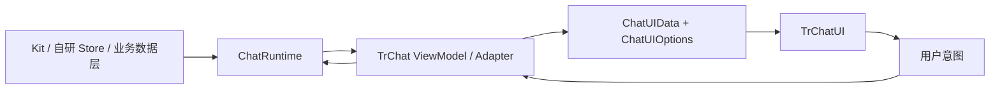

# Chat UI / Runtime 架构设计方向评审结论

> 评审对象：`chat-ui-design.md`、`chat-runtime-design.md` 及其当前实现
>
> 评审日期：2026-08-11
>
> 本文记录架构判断和后续演进方向，不代表已经完成对应源码改造。

## 1. 总体结论

当前设计方向是正确的，整体采用了：

> Ports & Adapters + ViewModel/Adapter + Presentational UI

现有分层可以继续保留，不建议推倒重来。但需要明确三个概念：

- `ChatRuntime` 是业务运行时协议，提供业务事实和业务动作；
- `TrChat` 是 Chat ViewModel / Adapter，负责把 Runtime 投影成 UI 所需的数据和交互状态；
- `TrChatUI` 是不依赖业务 Runtime 的 UI Shell，负责展示、局部 UI 状态和用户意图输出。

因此，`TrChatUI` 更准确的定位不是“纯渲染组件”，而是“业务无关的聊天 UI Shell”。它可以包含输入框、Aside、滚动和 Prompt 等 UI 交互策略，但不应承担请求、持久化、Provider、Transport 或业务成功判断。

## 2. 目标架构



### 2.1 数据流方向

```text
业务数据层
  -> ChatRuntime 读取状态、执行动作
  -> TrChat 进行数据映射、错误处理和临时 UI 状态投影
  -> ChatUIData / ChatUIOptions
  -> TrChatUI 展示

TrChatUI
  -> 输出用户意图
  -> TrChat
  -> ChatRuntime actions
  -> 业务数据层
```

UI 不应直接调用 Runtime；Runtime 也不应依赖具体 UI 组件。

## 3. 领域概念和职责边界

| 概念                 | 推荐定义                                           | 主要所有者                           |
| -------------------- | -------------------------------------------------- | ------------------------------------ |
| Domain Facts         | 会话、消息、请求状态、错误、模型和 MCP 当前状态    | `ChatRuntime`                        |
| User Intents         | 发送、取消、切换会话、模型选择、MCP 操作等用户意图 | `TrChatUI` 输出，`TrChat` 编排       |
| Presentation Options | 布局、文案、样式、渲染器和组件行为配置             | `TrChatUI` 输入                      |
| View State           | 草稿、Aside 开关、Drawer、滚动和焦点状态           | `TrChat` 或 `TrChatUI`，需单一所有者 |
| Request Context      | 当前请求使用的 Model、Feature、MCP Tool 快照       | Runtime adapter / 请求执行层         |
| UI Projection        | 面向渲染的普通 Data 和临时 pending                 | `TrChat`                             |

### 3.1 当前需要特别澄清的所有权

#### 输入草稿

当前输入值同时涉及：

- `TrSender` 内部编辑器；
- `ChatComposer`；
- `TrChat` 的 `useChatInput`；
- `ChatUIData.sender.inputValue`。

建议将输入协议收敛为：

- 受控模式：调用方持有 `inputValue`，UI 只输出更新事件；
- 非受控模式：UI 持有草稿，调用方通过事件获取变化；
- `TrChat` 负责业务适配和失败恢复，但不再与 UI 形成不透明的多份镜像。

#### Aside 和滚动

Aside open、Drawer 和滚动位置属于 UI 状态，不应进入 Runtime。左右 Aside 应采用一致的受控/非受控协议。

#### Model 和 MCP

Model/MCP 的选择和启用状态会参与请求配置，因此属于 Runtime 状态；按钮 loading 和临时 pending 可以由 `TrChat` 投影给 UI。两者需要在文档中明确区分：

- 业务状态由 Runtime 提供；
- 视觉 pending 由 Adapter 维护；
- UI 不自行推断业务成功。

## 4. 当前设计中值得保留的方向

### 4.1 Runtime 没有侵入基础设施

`ChatRuntime` 不直接承载 Provider、凭证、Transport 和 Tool 调用细节，基础设施由业务层或 Kit adapter 提供。这使 Runtime 能适配：

- `useLocalChatRuntime`；
- 已存在的 Kit conversation；
- Pinia、自研 Store 或其他消息引擎。

### 4.2 Runtime 协议使用结构化只读值

`ChatReadable<T>` 只要求 `.value`，避免公共协议绑定某个 Vue `Ref` 类型，适合跨 workspace Vue 版本或兼容响应式实现。

### 4.3 请求快照边界正确

`ChatRunConfig` 在发送时从当前 Model/MCP 状态生成并复制，随后写入消息 metadata。这样可以保证请求执行期间配置稳定，也方便追溯当前消息使用的模型和 Tool。

### 4.4 MCP 生命周期封装合理

安装、启用、Tool 加载、失败恢复和并发去重都留在 MCP Runtime adapter 内部，不要求 `TrChat` 理解 MCP 的完整生命周期。

## 5. 需要优先解决的设计断点

### 5.1 Runtime 错误和请求状态没有完整穿透到 UI

Runtime 定义了 `lastError`、`requestState` 和 `processingState`，但 `TrChat` 当前主要只映射 `loading`、`disabled` 和 `submitDisabled`。参见：

- `../src/types/runtime.ts`
- `../src/Chat.vue`
- `../src/types/ui/data.ts`

结果是：

- Runtime 的请求失败没有统一的 ChatUI 展示契约；
- `requestState` 的细节被压缩为单一 loading 布尔值；
- Model/MCP 失败主要落到日志，而不是用户可观察状态；
- 错误处理责任在业务层、Adapter 和 UI 之间不够明确。

建议增加面向 UI 的请求视图：

```ts
export interface ChatRequestView {
  state: 'idle' | 'requesting' | 'streaming' | 'completing' | 'completed' | 'aborted' | 'error'
  processingState?: string
  error?: unknown
}
```

由 `TrChat` 把 Runtime 状态投影到 `ChatUIData.request` 或 `ChatUIData.conversation`，再由默认 UI 或 error slot 决定如何展示。

### 5.2 Submit 的同步 UI 协议和异步 Runtime 协议没有完全闭环

Runtime 的 `send()` 区分 `true`、`false` 和 reject；但 `TrChatUI` 只同步 emit `submit`，并默认清空输入。

建议固定以下边界：

1. `TrChatUI` 只表达提交意图，不判断业务是否接受；
2. `TrChat` 负责调用 Runtime、处理返回值和恢复草稿；
3. 纯 UI 默认不因 submit 销毁草稿，或明确提供 accepted/rejected 机制；
4. `clearOnSubmit` 作为产品策略由 Adapter 决定，不应成为纯 UI 的隐式数据删除行为。

### 5.3 UI Options 和 Emits 存在两套交互协议

当前会话操作使用根级 emits，而 Prompt、Bubble、Model、MCP、Sender 和 Aside 使用 `ui.*.onXxx` callback。

这会导致：

- 消费者需要学习两套事件模型；
- `TrChat` 需要重复组合 callback；
- 新增交互时难以判断应该扩展 Options 还是 Emits；
- Vue DevTools 和模板事件无法统一观察。

建议未来将 `ChatUIOptions` 收敛为展示和行为配置，所有用户意图统一从 Emits 输出。旧 callback 可以保留一个兼容周期，但不再新增同类 API。

### 5.4 请求状态机需要成为正式协议

目前同时存在 `requestState` 和开放字符串 `processingState`。建议把状态转换和终态定义写入 Runtime 协议：

```text
idle
  -> requesting
  -> streaming
  -> completing
  -> completed

requesting / streaming / completing
  -> aborted
  -> error
```

同时明确：

- 同一会话是否允许并发请求；
- abort 后是否保留 error；
- retry 是否生成新的 request ID；
- 哪些状态会让 Sender loading；
- `false` 与 reject 是否都恢复草稿。

### 5.5 ChatRuntime action 的失败和 pending 契约不完整

`createConversation`、`switchConversation`、`renameConversation` 和 `deleteConversation` 可以返回 Promise，但 UI Adapter 当前没有统一的 action pending/error 视图。

建议引入按操作区分的状态，而不是只维护零散的布尔值：

```ts
interface ChatOperationState {
  pending: boolean
  error?: unknown
}

interface ChatOperationsView {
  send: ChatOperationState
  conversation: ChatOperationState
  model: ChatOperationState
  mcp: ChatOperationState
}
```

如果不希望把这些状态放进 Runtime，则应明确由 `TrChat` 负责，并通过 `ChatUIData` 完整投影给 UI。

## 6. 推荐的目标协议

### 6.1 `ChatRuntime`

Runtime 应只暴露业务事实、业务状态和业务动作：

```ts
export interface ChatRuntime {
  conversations: ChatReadable<readonly ChatConversationInfo[]>
  activeConversation: ChatReadable<ChatConversation | null>
  composer: ChatComposerRuntime
  operations?: ChatReadable<ChatOperationsView>
  actions: ChatRuntimeActions
}
```

其中 `ChatRuntimeActions` 的关键约定是：

- `send` 明确 accepted、rejected 和 failed；
- `abort` 与 request 生命周期绑定；
- 会话动作明确 Promise 失败行为；
- Runtime 不负责 UI toast、Drawer 或视觉布局。

### 6.2 `TrChat`

`TrChat` 作为 ViewModel/Adapter：

- 将 Runtime 状态转换为 `ChatUIData`；
- 将 UI emits 转换为 Runtime actions；
- 维护草稿恢复和视觉 pending；
- 捕获并投影错误；
- 组合业务 callback，但不让 ChatUI 直接感知 Runtime。

### 6.3 `TrChatUI`

`TrChatUI` 的输入应逐步收敛为：

```ts
interface ChatUIProps {
  data?: ChatUIData
  ui?: ChatUIOptions
  inputValue?: string
  defaultInputValue?: string
}
```

其中：

- `data` 是只读展示事实；
- `ui` 只放布局、文案和展示配置；
- 输入通过标准 `inputValue / defaultInputValue / update:inputValue` 管理；
- 用户动作通过 emits 输出；
- UI 不等待 Runtime action，也不伪造业务成功。

## 7. 推荐演进顺序

### P1：先闭合核心链路

1. 明确 `TrChat` 是 ViewModel/Adapter，而非简单透传层。
2. 补齐 Runtime error/status 到 ChatUIData 的映射。
3. 统一 submit、草稿清空和失败恢复语义。
4. 统一输入状态所有权，减少多份草稿镜像。

### P2：再收敛公共 API

1. 统一 callback 和 emits，停止新增 callback 型事件。
2. 左右 Aside 采用一致的 controlled/uncontrolled 协议。
3. 统一事件为对象 payload，增加稳定 ID 和请求上下文。
4. 固化 Runtime 状态机和 action pending/error 协议。
5. 为 `ChatRunConfig` 增加版本、retry 和恢复语义。

## 8. 非目标

本架构不建议让 `ChatRuntime` 负责：

- Provider credentials；
- Transport 和网络客户端实现；
- UI 布局、主题和 Drawer；
- toast、modal 等视觉反馈；
- 具体 UI 组件实例；
- 业务层无法复用的页面级交互细节。

## 9. 最终判断

这套设计已经具备从单一聊天 Demo 演进为可复用 Chat Suite 的基础。下一阶段的重点不是增加更多 UI 能力，而是把以下边界写成稳定协议：

1. 谁拥有状态；
2. 谁负责异步结果；
3. 错误如何跨层传播；
4. 用户意图使用哪一种事件模型；
5. 请求状态和请求快照如何关联。

完成这些收敛后，架构可以稳定地支持：

- 默认的 Kit/Runtime 聊天页面；
- 自研 Store 接入；
- 多种 ChatUI 外壳；
- 可替换的 Model/MCP 能力；
- 可测试的失败恢复和请求生命周期。
